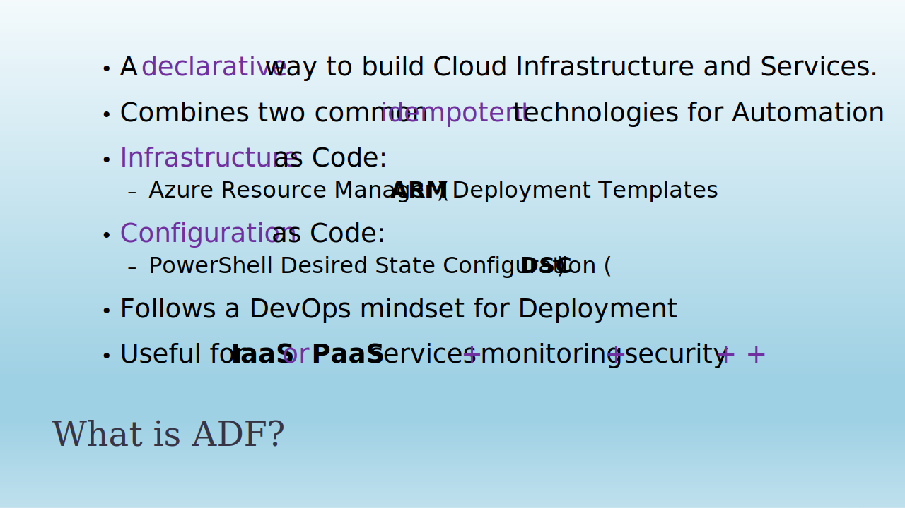
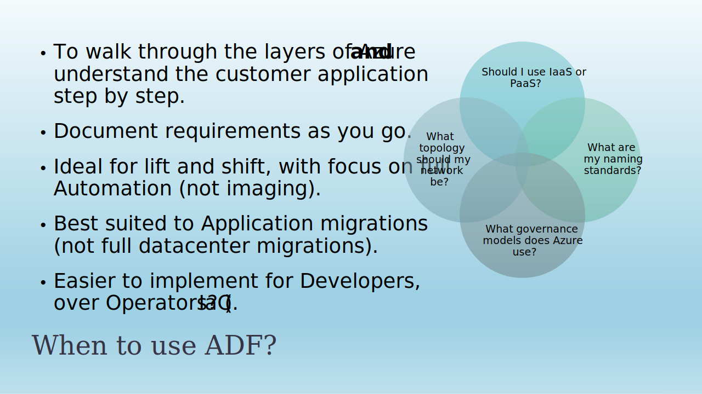
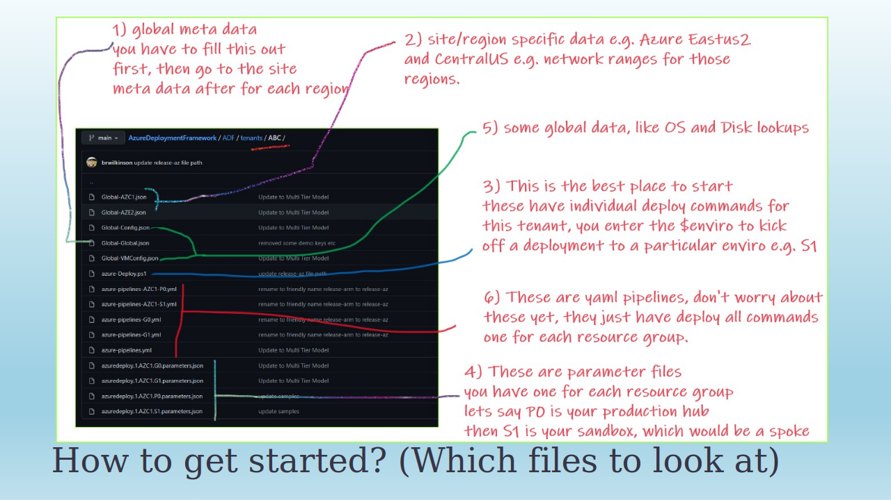
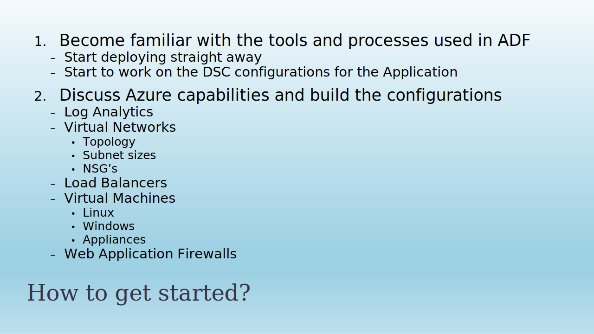
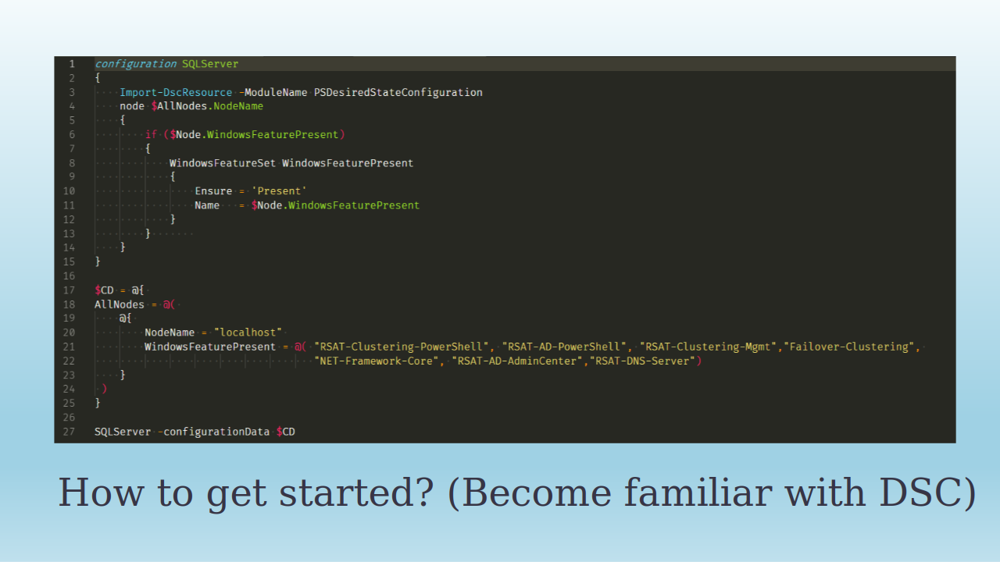
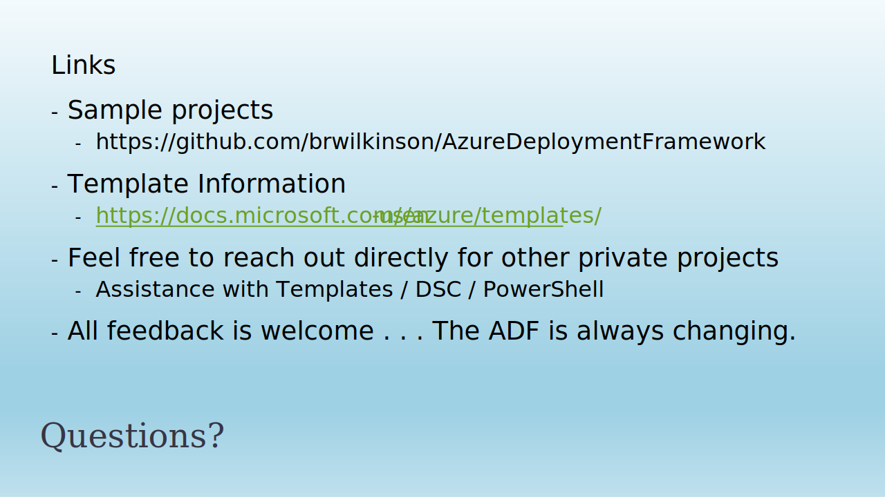

#  Observations on ARM (Bicep) Templates

## - Azure Deployment Framework docs sections
- Go: [README](https://github.com/brwilkinson/AzureDeploymentFramework#readme){:target="_blank"} (GithHub Home)
- **This page:** [What is ADF (PPT)](./ADF.md)
- Go: [Documentation Home](./index.md)

* * *

- [Download - What is ADF (PPTX)](./Slides_ADF.pptx)
- [Download - What is ADF (PDF)](./Slides_ADF.pdf)

**some images are out of date, VSCode is the recommended development environment*

**some images are out of date, VSCode is the recommended development environment*

**some images are out of date, Global data is now managed in separate config/metadata files per Tenant/App*

**image is only a guide*

- [Documentation - What is ADF, Observations on ARM (Bicep) Templates Etc.](./index.md)
