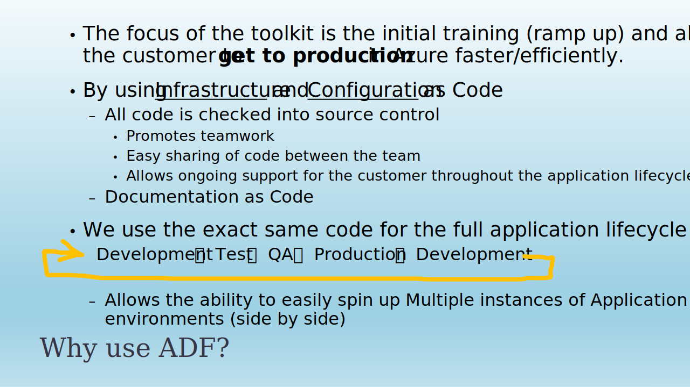
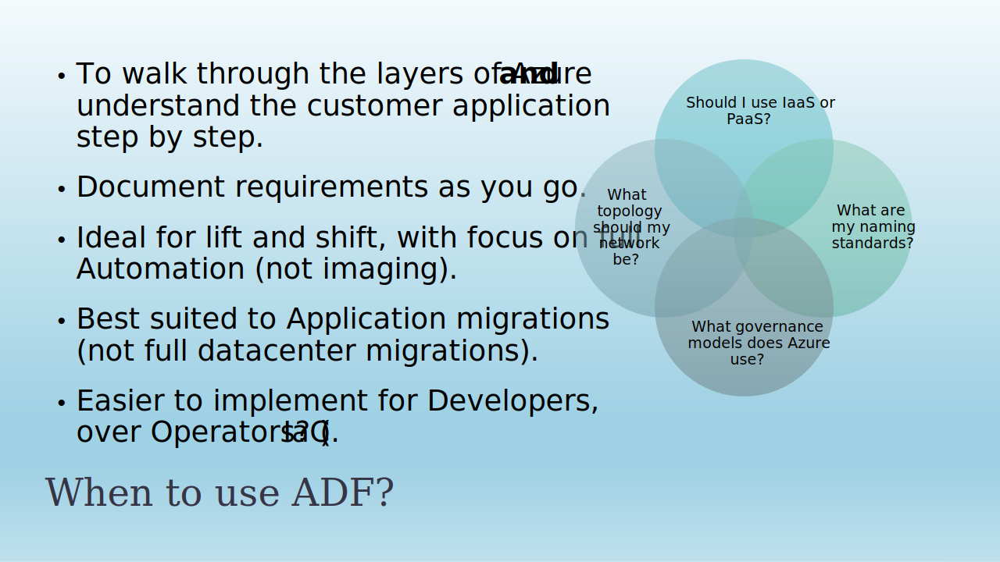
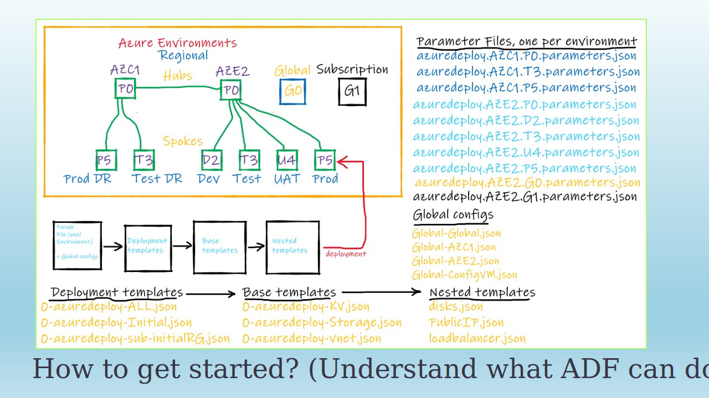
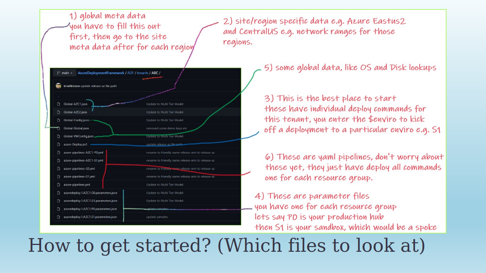
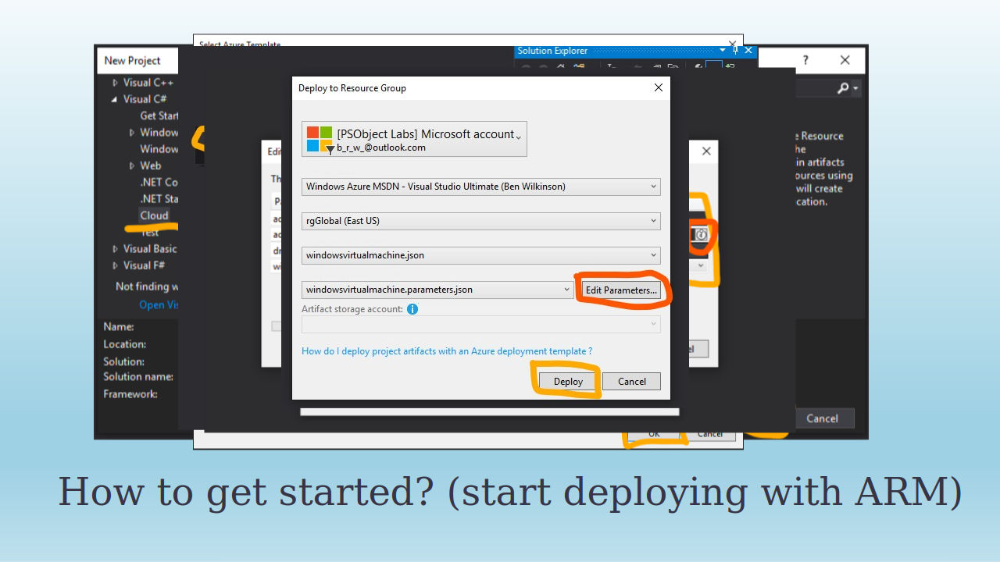
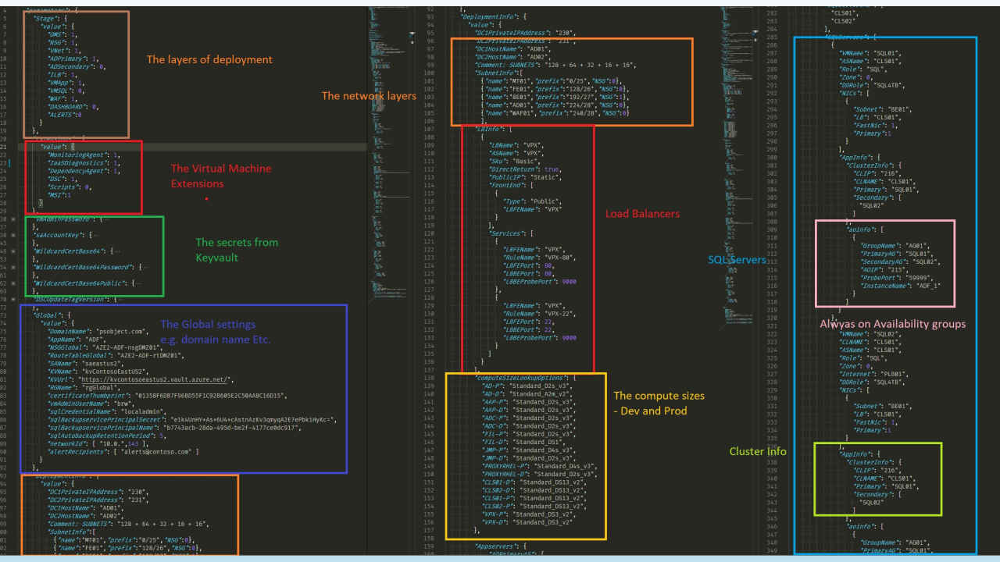
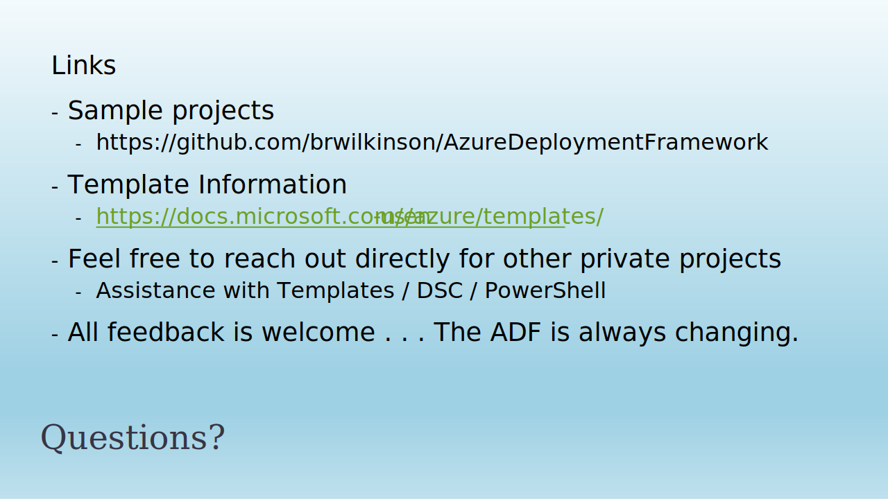

#  Observations on Arm templates # 

## - Azure Deployment Framework ## 
Go Home [Documentation Home](./ARM.md)

- [Documentation - What is ADF (PPTX)](./ADF.pptx)
- [Documentation - What is ADF (PDF)](./ADF.pdf)

