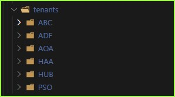

## Observations on ARM (Bicep) Templates 

## - Azure Deployment Framework ## 
- Go Home [Documentation Home](./index.md)
- **Go Next** [RBAC and Role Assignments](./RBAC_RoleAssignments.md)

* * *

### App Tenants

The Framework supports deploying Multiple Applications, each application is referred to as a Tenant within the ADF.

A single DevOps Team owns all of the deployments for all of the tenants in the projects, including all release pipelines.

If you only have a single Tenant, you can just deploy the HUB/Spoke Environments from a single tenant.

####  Apps shown in project (tenants directory, with each tenant/App)

####  Overview of each tenant/App

|Tenant/App|Tenant|Subcription|Description|Information|Should I clone this?|
|:-|:-|:-|:-|:-|:-|
|ABC|MSDN|PSThing Labs|IaaS Legacy||No|
|ADF|Microsoft|AIRS|IaaS||No|
|AOA|Microsoft|AIRS|Cloud Native|Most samples are here|Yes for PaaS|
|HAA|HAAPP|HA App Labs|PaaS||No|
|HUB|MSDN|PSThing Labs|IaaS Legacy||No|
|PSO|MSDN|PSThing Labs|IaaS Legacy||No|

####  Why are there so many Tenants/Apps

Some of the parameter files contains reference objects that you can copy into other tenant param files, if you need them.

The goal will be to document the paramter files in 1 or more tenant to offer reference architectures.

