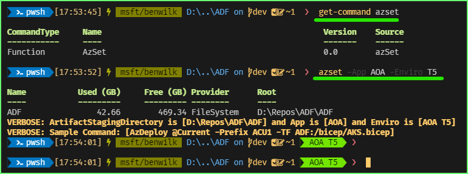
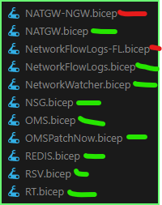

## Observations on ARM (Bicep) Templates 

## - Azure Deployment Framework ## 
- Go Home [Documentation Home](./index.md)
- **Go Next** [Nested Templates/Modules](./Nested_Templates.md)

* * *

####  Base Templates

Using a base template is really Easy.

The first thing you have to do is [choose the Scope of your deployment](./Getting_Started.html)
- Prefix (location/region)
- Enviro (the resource group)
- The App tenant (the application you are working with, often maps to a subscription).

As a mimimum I recommend to do the following in your Powershell profile.

```powershell
$Repos = "d:\repos"
Import-Module -Name $Repos/ADF/ADF/release-az/azSet.psm1 -Scope Global -Force
```

Once you have the module loaded you can use the commands `azset`

####  Azure PowerShell based deployments with azSet


As you can see the script sets some Environment Variables, that you can use on your prompts

After this you are ready to deploy a template, since we loaded `T5` which is  parameter file for our Test 5 Environment, we should reference that template file ADF\tenants\AOA\ACU1.T5.parameters.json

Now you can decide which layer you would like to deploy. Often you would deploy an [Orchestration Template](./Orchestration_Templates.html) first that will deploy your foundation for a new Resource Group and other resource types. Once you have that generally you can just deploy the Base template for a specific resource type as below.

```powershell
# Deploy all of the storage accounts in the T5 parameter file
AzDeploy @Current -Prefix ACU1 -TF ADF:/bicep/SA.bicep

# Deploy only the single storage account from the T5 parameter file.
AzDeploy @Current -Prefix ACU1 -TF ADF:/bicep/SA.bicep -CN data

# Deploy only the any multiple of storage account from the T5 parameter file.
AzDeploy @Current -Prefix ACU1 -TF ADF:/bicep/SA.bicep -CN data,data2

```

When deploy Base templates for virtual machines we categorise the VM's into sub Deployments.

- So when you deploy them you have to also add the layer via the DeploymentName
- This makes it easier to orchestrate the layer e.g. ADPrimary first, then ADSecondary, then SQLServers, then AppServers
- Note if there are multiple servers in the AppServers or SQLServers list you can still use `-CN JMP01`

```json
        "Appservers": {
          "AppServers": [
          ],
          "SQLServers": [
          ]
        },
```

```powershell
# Deploy the ADPrimary VM in Appservers in The T5 parameter file
AzDeploy @Current -Prefix ACU1 -TF ADF:\bicep\VM.bicep -DeploymentName ADPrimary

# Deploy the AppServers VMs in Appservers in The T5 parameter file
AzDeploy @Current -Prefix ACU1 -TF ADF:\bicep\VM.bicep -DeploymentName AppServers

# Deploy the AppServers VMs in Appservers in The T5 parameter file, however only JMP01 from that list
AzDeploy @Current -Prefix ACU1 -TF ADF:\bicep\VM.bicep -DeploymentName AppServers -CN JMP01

```

Any Template that has a short name without a Dash can be deploy directly as a Base Template.

e.g. in the bicep directory ADF\bicep



- The green templates are base
- The red one is nested template.

A nested template is a sub module that gets called from a Base template or anohter nested template.

For example as below.


You deploy the Base template `SB.bicep` then it calls the child/nested modules

```powershell
# Deploy all of the service Bus from T5 into Central US
AzDeploy @Current -Prefix ACU1 -TF ADF:/bicep/SB.bicep
```

#### You can easily discover the Bicep Base templates on the command line, since they are in the same directory

