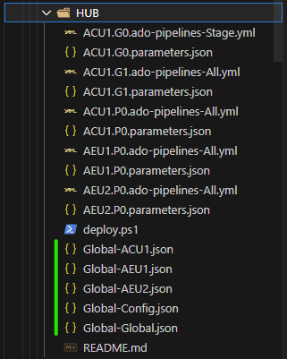

## Observations on ARM (Bicep) Templates 

## - Azure Deployment Framework ## 
- Go Home [Documentation Home](./index.md)
- **Go Next** [Deploying From PowerShell](./Deploying_From_PowerShell.md)

* * *

####  Global Settings

|Tenant/App|Description|
|:-|:-|
|HUB|A Hub Deployment for Shared Services Hub Tenant|



|File Name|Purpose|
|:-|:-|
|Global-Global.json|The main Global File for the tenant. Main settings including User and Group id lookups|
|Global-Config.json|This file contains an export for all Role Definitions, allows translation between role name and ID|
|Global-**{REGIONPrefix}**.json| e.g. Global-ACU1.json or Global-AEU2.json These files contain regional settings and mappings|

#### Examples - Global-Config.json

- The below script can be executed to generate or update the file with roles from your subscription
  - This command can be found in the deploy.ps1 in each tenant
    - ADF\tenants\HUB\deploy.ps1 

```powershell
# Export all role defintions per Subscription, only needed 1 time or when new roles added
. ADF:\1-prereqs\04.1-getRoleDefinitionTable.ps1 @Current
```

```json
  "RolesGroupsLookup": {
    "Access Review Operator Service Role": {
      "Id": "76cc9ee4-d5d3-4a45-a930-26add3d73475",
      "Description": "Lets you grant Access Review System app permissions to discover and revoke access as needed by the access review process."
    },
    "AcrDelete": {
      "Id": "c2f4ef07-c644-48eb-af81-4b1b4947fb11",
      "Description": "acr delete"
    },
```


### Examples - Global-Global.json

```json
{
  "Global": {
    "OrgName": "PE", // The name of the Org, this is the only value you need to change
                     // This ensures ALL resources have a unique name
    "AppName": "HUB", // The name of the tenant/App
    "GlobalSA": {
      "name": "global" // The Name of the Global storage account
                       // will be expected to be in the global Resource Group 
    },
    "GlobalACR": {
      "name": "global" // The Name of the Global container registry
                       // will be expected to be in the global Resource Group
    },
    "GlobalRG": { // The Name of the Global Resource Group
      "name": "G1"
    },
    "AppId": 0, // Used to ensure Networks don't overlap IP Address space per app/tenant
                // Ensure that any 2 Tenants that need to talk over vnet peering have different
                // AppId number. Supports 32 non overlapping address spaces each 2048 addresses/ per region
    "Network": { // Default network base numbers, you do not need to change this.
      "first": 10,
      "second": 248,
      "third": 248
    },
    "PrimaryLocation": "CentralUS", // Default primary location
                                    // the Global Resource Group will be in this region
    "SecondaryLocation": "EastUS2", // Default secondary location
    "IPAddressforRemoteAccess": [   // Address ranges that get added to Firewall allow lists
      "62.162.123.81/32"            // E.g. to connect to a keyvault or AKS etc
    ],
    "vmAdminUserName": "brw",       // Admin username
    "sqlCredentialName": "sqladmin",// SQL Admin username
    "ADDomainName": "aginow.net",   // Domain for internal AD
    "DomainName": "aginow.net",     // Domain for apps private DNS
    "DomainNameExt": "aginow.net",  // Domain for app public/External DNS
    "_hubSubscriptionID": "b8f402aa-20f7-4888-b45c-3cf086dad9c3",
    "__DomainNameExtSubscriptionID": "b8f402aa-20f7-4888-b45c-3cf086dad9c3",
    "__DomainNameExtRG": "ACU1-PE-AOA-RG-G1",
    "ADOProject": "ADF",                       // Azure DevOps Project Name
    "AZDevOpsOrg": "AzureDeploymentFramework", // Azure DevOps Org Name
    "ServicePrincipalAdmins": [                // Lookup for name of Owners on Service Principals
      "BenWilkinson-ADM"                       // and AD Applications, as well as DevOps Connections
    ],
    "apimPublisherEmail": "benwilk@aginow.net",
    "alertRecipients": [
      "benwilk@aginow.net"
    ],
    "ObjectIdLookup": { // This is a table lookup for Groups, Users and Applications
                        // This is used so that you can use a Friendly name for Role assignments in your parameter files
      "brwilkinson": "013ea2d0-e8da-41a9-bf4a-73b04841bf13",
      "AzureKeyVault": "93c27d83-f79b-4cb2-8dd4-4aa716542e74",
      "AKS_Admins": "013ea2d0-e8da-41a9-bf4a-73b04841bf13",
      "ADO_ADF_ACU1-PE-HUB-RG-G0": "4f3e8446-060f-45f4-b4f1-8104b4a83162" // These Service Principals 
                                                                          // are automatically generated in this file
                                                                          // see below
    }
  }
}

```
  - This command to generate service principals and service connection can be found in the deploy.ps1 in each tenant
    - ADF\tenants\HUB\deploy.ps1
  - Below commands will generate the SP lookup shown above in the Global-Global.json file
    - One for each stamp/environment within each tenant 
```powershell
# App pipelines in AZD New or update Owner
New-ADOAZServiceConnection -Prefix ACU1 -App $App -IncludeReaderOnSubscription -Environments G0, G1, P0
New-ADOAZServiceConnection -Prefix AEU2 -App $App -IncludeReaderOnSubscription -Environments P0
# New-ADOAZServiceConnection -Prefix AEU1 -App $App -Environments P0

# update secrets
Set-ADOAZServiceConnection -Prefix ACU1 -App $App -RenewDays 360 -Environments G0, G1, P0
Set-ADOAZServiceConnection -Prefix AEU2 -App $App -RenewDays 360 -Environments P0
```


### Examples - Global-RegionalPrefix.json

```json
{
  "Global": {
    "hubRG": { // The Hub resource group for this region
      "name": "P0"
    },
    "hubKV": { // The keyvault resource group/Name for this region
      "name": "VLT01"
    },
    "hubAA": { // The Automation Account Name for this region
      "name": "OMSAutomation"
    },
    "DNSServers": [ // The DNS servers for this region
                    // Blank for Azure DNS
                    // Used for the whole region, however can be over written in 
                    // Any individual Stamp/Resource Group
      // "10.192.248.4" // Use Azure DNS for now instead of DNSForwarder
    ],
    "RTName": "Hub",
    "shutdownSchedulerTimeZone": "Pacific Standard Time",
    "patchSchedulerTimeZone": "America/Los_Angeles"
  }
}
```