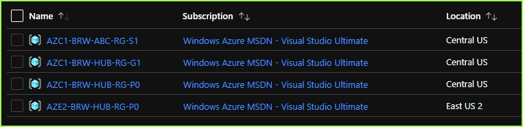
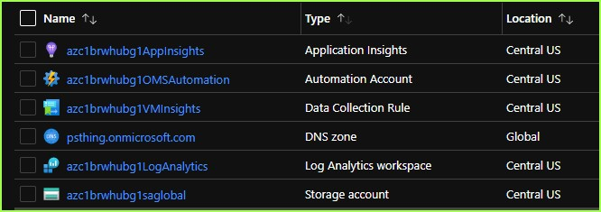
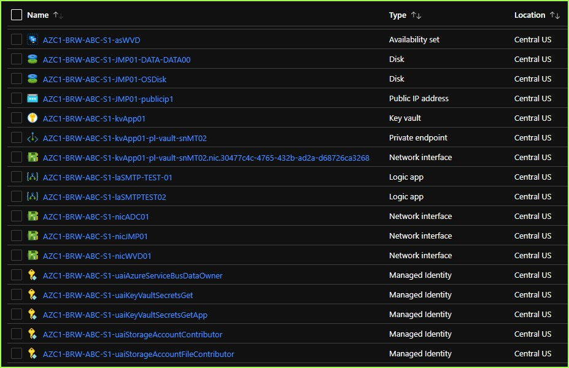

## Observations on ARM (Bicep) Templates 

## - Azure Deployment Framework ## 
- Go Home [Documentation Home](./index.md)
- **Go Next** [Naming Standards Prefix](./Naming_Standards_Prefix.md)

* * *

### Naming Standards - These are configurable, however built into this project by design.

##### *Azure Resource Group Deployment - Multi-Region/Multi-Tier Hub/Spoke Environments*

**Common naming standards/conventions/examples:**

```diff
+       - ACU1-FAB-ADF-RG-S1
             - [Central US Deployment for Fabrikam organization, for ADF App team Resource Group
                 Sandbox 1 RG]
            
+       - ACU1-FAB-ADF-S1-wafFW01
            - [Central US Deployment for Fabrikam organization, for ADF App team, deploying a Web App. 
                Firewall in Sandbox 1 Resource Group]
!                   - The name that you provide: FW01
            
+       - ACU1-FAB-ADF-S1-vmSQL01
            - [Central US Deployment for ADF App team, 
                deploying vmSQL01 Azure Virtual Machine in Sandbox 1 Resource Group]
!                   - The name that you provide: SQL01
            
+       - ACU1ADFS1SQL01
            - [Central US Deployment (VM hostname on internal Domain [15 char limit]) for ADF App team, 
                deploying SQL01 VM in Sandbox 1 Resource Group]
!                   - The name that you provide: SQL01
                    - OrgName [FAB] is not included, since on internal domain and limit is 15 chars.
            
+       - ACU1-FAB-ADF-S1-nicSQL01
            - [A Network interface on the above Virtual Machine]
            - Generated from VM Name e.g. SQL01
            
+       - ACU1-FAB-ADF-S1-vn
            - [A Virtual Network in the Sandbox 1 Resource Group - a Spoke Environment]
            - Always 1 VNET per RG/Environment, also per Parameter file definition.
            
+       - ACU1-FAB-ADF-RG-S1
            - [The Spoke Resource Group for Above (ADF App)]
            
+       - ACU1-FAB-HUB-RG-P0
            - [The HUB Resource Group for HUB App]
            
+       - acu1fabhubg1saglobal
            - [Central US Deployment for FAB organization, for HUB App team, deploying a storage account 
                (lower case 24 char limit) in Global (G1) Resource Group]
!                   - The name that you provide: global
            
+       - ACU1-FAB-HUB-P0-kvVLT01
            - [Central US Deployment for FAB organization, for HUB App team, deploying a keyvault 
                in the HUB (P0) Resource Group]
!                   - The name that you provide: VLT01
            
+       - ACU1-FAB-HUB-P0-kvVLT01-pl-vault-snMT02.nic.50a08879-44ce-4a16-a9e9-8595ce9734ca
            - [A private link connection on the above Keyvault to subnet MT02]
            
+       - ACU1-FAB-HUB-P0-networkwatcher
            - [Network watcher on above HUB]
            
+       - ACU1-FAB-HUB-P0-networkwatcher/ACU1-FAB-ABC-S1-fl-AzureBastionSubnet
            - [A Subnet from S1 Spoke Bastion Subnet connecting back to the Hub Network watcher]
```

|Name |Example|Allowed/Sample Values |Defintion |
|---|---|---|---|
|Example_Resource |**ACU1-FAB-HUB-P0-kvVLT01**|ACU1-FAB-HUB-P0-kvVLT01|A sample resource name used in this table<br/> Sample of a keyvault name |
|[Prefix](./Naming_Standards_Prefix.md) |**{Prefix}**-FAB-HUB-P0-kvVLT01|AZE2 + ACU1|Location - Azure Region (Using Azure Partner Regions) |
|DeploymentID |ACU1-FAB-HUB-P**{DeploymentID}**-kvVLT01|0 + 1 --> 8 <br/> 00 + 01 --> 15|The deployment iterations (configured to 8 environments) <br/>The deployment iterations (configured to 16 environments)<br/>- Network ranges in Hub/Spoke are dynamically assigned based on this [DeploymentID] |
|Environment|ACU1-FAB-HUB-**{Environment}**0-kvVLT01|S + D + T + Q + U + P |The specific environment type:<br/>[Sandbox --> Dev --> Test --> UAT --> QA --> Prod]|
|etype|Prod|PreProd + Prod|The general environment type |
|Enviro |ACU1-FAB-HUB-**{Enviro}**-kvVLT01|D03 + T04 + Q06 + U08 + P09 + P00 <br/>S1 + D2 + D3 + T4 + U5 + P6 |The environment name (16 environments)<br/>The environment name (8 environments)|
|OrgName|ACU1-**{OrgName}**-HUB-P0-kvVLT01|FAB or ADW or WTP or FAB|Your 3 letter Organization (company) name.<br/>This ensures public Azure Resources have a unique name|
|App|ACU1-FAB-**{App}**-P0-kvVLT01|ADF, HUB, PSO, ABC|The App (tenant) name|
|ResourcePrefix|ACU1-FAB-HUB-P0-**{ResourcePrefix}**VLT01|kv,sa,vm,vmss,fw,waf,nsg|The resource type prefix<br/>e.g. kv|
|Name|ACU1-FAB-HUB-P0-kv**{Name}**|short name e.g. VLT01|The resource name, this is the part that you define in the parameter file|
|Deployment |**{Deployment}**-kvVLT01| ACU1FABADFS1 + ACU1-FAB-ADF-S1 + acu1fabadfs1 | Used for naming resources e.g. part of hostname and Azure Resource names, lower for storage Etc.<br/> [Prefix + App + Enviro]|
|Subscription|G0|Azure Subscription Deployments G0|E.g. RBAC or Policy|
|Global|G1|A Global environment G1 represents Azure Global Services|E.g. DNS Zones or Traffic Manager OR GRS Storage|
|HUB|P0|A Hub environment is denoted by the P0 or P00|ACU1-FAB-ADF-P0 Central Hub, AZE2-FAB-ADF-P0 EastUS2 Hub|
|DR + HA|P0 or any other mirrored environment<br/> E.g. U4 or P6|Primary Test environment ACU1-FAB-ADF-T4 would have a mirror environment<br/>DR Test environment AZE2-FAB-ADF-T4 in the partner region|A mirror would exist for a Test and Prod environments, <br/>Plus the associated HUB environment|
|* | ------------------------------------------------------------- | * |---------------------------|

<br/>

#### *How are the standard implemented?*

The name of any resource is determined via the following method.
    - Example the Hub tenant, Central US Global Parameter File

- [The Paremter File that you are deploying](https://github.com/brwilkinson/AzureDeploymentFramework/blob/main/ADF/tenants/AOA/ACU1.G1.parameters.json){:target="_blank"}
    - The parameter file defines a Resource Group
    - This contains, the 3 parameters that automatically build the resource names.
        - [Prefix](./Naming_Standards_Prefix.md)
        - Environment
        - DeploymentID

            ```jsonc
              "parameters": {
                "Prefix": {
                  "value": "ACU1"
                },
                "Environment": {
                  "value": "G"
                },
                "DeploymentID": {
                  "value": "1"
                },
            ```

- [Each template reads these values e.g. Storage Template](https://github.com/brwilkinson/AzureDeploymentFramework/blob/main/ADF/bicep/SA.bicep#L35){:target="_blank"}
    - The template combines the parts to create a **Deployment** Variable.
    - Where appropriate the template also combines the parts to create a **DeploymentURI** Variable.
        - This URI will be lower case  a exclude any dashes Etc.
        - This is used for URI's and also things such as storage account names.
        ```bicep
        var Deployment = '${Prefix}-${Global.OrgName}-${Global.Appname}-${Environment}${DeploymentID}'
        var DeploymentURI = toLower('${Prefix}${Global.OrgName}${Global.Appname}${Environment}${DeploymentID}')
        ```
    - Within the resources section any resource that is created uses the Deployment/DeploymentURI variable.
        - The Deployment + the resource type prefix + the Resource short name.
            - The Resource short name comes from the parameteter file for each enironment e.g. global
        ```bicep
        // a storage account
        resource SA 'Microsoft.Storage/storageAccounts@2021-06-01' = {
            name: toLower('${DeploymentURI}sa${storageInfo.name}')
        }
        ```

        ```bicep
        // a virtual machine
        resource virtualMachine 'Microsoft.Compute/virtualMachines@2021-04-01' = {
            name: '${Deployment}-vm${AppServer.Name}'
        ```
- [The Parameter File that you are deploying](https://github.com/brwilkinson/AzureDeploymentFramework/blob/main/ADF/tenants/AOA/ACU1.G1.parameters.json){:target="_blank"}
    - The parameter also contains individual resource definitions for that Resource Group
    - Notice the name value above for 'global' comes from the parameter file as below.
        ```json
        "DeploymentInfo": {
          "value": {
            "saInfo": [
              {
                "name": "global",
                "skuName": "Standard_RAGRS",
                "allNetworks": 1,
                "largeFileSharesState": "Disabled",
                "logging": {
                  "r": 0,
                  "w": 0,
                  "d": 1
                }
              }
            ]
          }
        }
        ```
- [There is additional Global Metadata for each tenant (App Group)](https://github.com/brwilkinson/AzureDeploymentFramework/blob/main/ADF/tenants/AOA/Global-Global.json){:target="_blank"}
    - This is kept in the global file, so that it doesn't have to be included in each individual parameter file
    - This information will be static per App Group/Tenant.
    ```json
    "Global": {
        "hubSubscriptionID": "1f0713fe-9b12-4c8f-ab0c-26aba7aaa3e5", // Optional if different from current
        "OrgName": "PE", //<--- Change this to your unique 2 or 3 letter OrgName
        "AppName": "HUB",
    ```
    - The references to these can be seen above on the Deployment variable
        - Global.OrgName
        - Global.Appname
        ```bicep
        var Deployment = '${Prefix}-${Global.OrgName}-${Global.Appname}-${Environment}${DeploymentID}'
        var DeploymentURI = toLower('${Prefix}${Global.OrgName}${Global.Appname}${Environment}${DeploymentID}')
        ```

##### As a consumer of this project you are **not responsible** for managing naming standards/conventions.
-  **Naming standards are baked in**, you only provide the short resource name. 
- **It is possible to change the default naming convention to meet your organizational needs**
    -  I wouldn't recommend it, however you would simply update the **"Deployment"** variable (shown above) to your new format.
##### Short Resource Name examples:
    - global     e.g. storage name
    - SQL01      e.g. Virtual Machine Name
    - App01      e.g. Keyvault Name
    - FW01       e.g. Web Application Firewall Name

### Sample portal images based on this naming convention.
#### Sample - ResourceGroups

#### Sample - Global **G1** Resource Group Resources

#### Sample - Spoke **S1** Resource Group Resources



* * *

