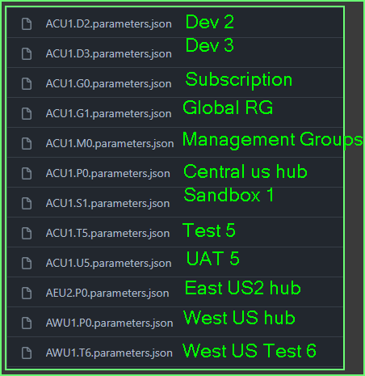

#  Observations on ARM (Bicep) Templates

## - Azure Deployment Framework
- Go Home [Documentation Home](./index.md)
- **Go Next** [Orchestration Templates](./Orchestration_Templates.md)

* * *

####  Parameter Files Usage

There is a parameter file for each deployment layer [Deployment Partitions](./Deployment_Partitions.md)
- Tenant
- Management Groups
- Subscription
- Global Resources
- 1 Hub per region
- multiple spokes per region

Parameter file samples: Once you clone an Org Directory e.g. AOA there are samples

https://github.com/brwilkinson/AzureDeploymentFramework/tree/main/ADF/tenants/AOA

- You can delete any parameter file that you don't need
- You can easily clone a whole environment just by cloning the parameter file
    - Then giving it a new ID and Prefix to match the Region and Deployment Env Type e.g. D2

