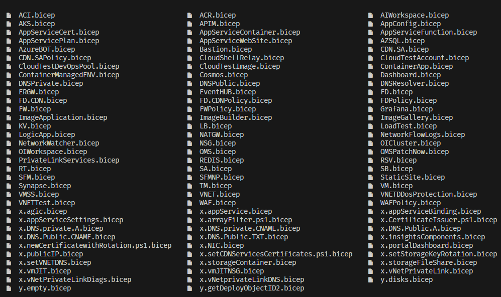

## Azure Deployment Framework - version 0.0.3 [[ADF Docs]](https://brwilkinson.github.io/AzureDeploymentFramework/).

#### Goals of this project
- Implement a composable model for Environment deployments
  - Composition and Orchestration is defined 100% in the parameter file, not within templates.
  - All deployment pipelines are static and re-usable, no composition is needed in pipelines.
- Implement a version 1.0.1 template release when [Bicep](https://github.com/Azure/bicep) goes version 1.0.1
- Implement new Bicep Preview Feature (in progress) for version 0.0.4
  - BicepParam (Bicep parameter files)
  - User-defined data types for all object definitions
    - [bicep/user-defined-data-types](https://learn.microsoft.com/en-us/azure/azure-resource-manager/bicep/user-defined-data-types) 

#### This is now Version 0.0.3
- version 0.0.3 is main branch - current
- version 0.0.2 in ADFv2 branch - created March 2023
- version 0.0.1 in armjson branch - created 2022

#### This project is currently in Preview. [[ADF Source]](https://github.com/brwilkinson/AzureDeploymentFramework)
- If you have previously forked this project, I recommend to pull in recent commits [Mar 2023]
  - The project setup steps have been streamlined.
  - Automatic network setup.
  - Advanced template capabilities around Zero Trust.

* * *

### - Declarative Infrastructure

- [Documentation - What is ADF, Observations on ARM (Bicep) Templates Etc.](https://brwilkinson.github.io/AzureDeploymentFramework/)
- [Documentation - Ready to Deploy? Getting Started Steps](https://brwilkinson.github.io/AzureDeploymentFramework/Getting_Started)

    - [Status - Deployment Workflows GitHub](./Deployment_Pipelines_GitHub.md)
    - [Status - Deployment Pipelines Azure DevOps](./Deployment_Pipelines_DevOps.md)

* * *

**Is this Framework worth considering?**

    If I walk into your organization and look at your App Catalog or CMDB for your core 
    business Applications.
    
    - How many applications do you have? (10 or 100 or 1000?)
    
    Which of those applications are really Core Business applications/services?
    
    - Which generate the most revenue?
    - Which provide the most value to your customers?
    - Which are fundamentally important for running your business?
    
    Once you identify those applications/services, you need to ensure they are running in the most: 
        - efficient
        - secure
        - reliable
        manner possible, your business and competitive advantage in the marketplace depends on it.
    
    How do you enhance the lifecycle of those applications and the infrastructure in a Cloud First world?
        - How do you iterate in the Sofware development lifecycle with velocity, while maintaining quality?

**Microsoft recommends that you follow the:**
- <a href="https://docs.microsoft.com/en-us/azure/cloud-adoption-framework/" target="_blank">Cloud Adoption Framework</a>
- <a href="https://docs.microsoft.com/en-us/azure/architecture/framework" target="_blank">Microsoft Azure Well-Architected Framework</a>

**Once you are familiar with those, how do you actually implement? Taking 1 or more of those Core App Platforms and move them to the Cloud using a Fully Declarative Model?**
    
    How do you actually implement those design patterns that are in the architectural documentation?
    How do you actually start designing and deploying your application code?
    How do you prototype out design models allowing faster testing and validation, while staying within budget?
    How do you define, deploy and release to as many environments that your application needs for: 
        - Dev, Test, QA, UAT, PROD, DR Etc. across regions.
    How do you Train your staff on Cloud principles and keep up with the rapid pace of Cloud capabilites?
    How do you Document what your environments look like and at the same time manage rapid Change?

**Perhaps you just need a Lab environment:**

    If you are looking to build out Lab/Demo environments then the ADF will work very nicely.
    - Most of the work is deploying specific App Components
    - So if you are just wanted lab environments, you can get up and running with ADF very fast, 
        - Hopefully within 1 week
    - The DSC components in this project allow for Domain Controller or SQL Server clusters to be deployed
        - If you are still leveraging IaaS services, this could be very useful.

**If above is something that is of interest to you, then this project can help.**

- [Documentation - What is ADF, Observations on ARM (Bicep) Templates Etc.](https://brwilkinson.github.io/AzureDeploymentFramework/)
- [Documentation - Ready to Deploy? Getting Started Steps](https://brwilkinson.github.io/AzureDeploymentFramework/Getting_Started)

##### **Full list of templates:**
<a href="https://github.com/brwilkinson/AzureDeploymentFramework/tree/main/ADF/bicep" target="_blank">ADF/bicep</a>

##### Any Feedback on this project is welcome, please feel free to reach out or ask questions, open a 'Discussions' or 'Issues'.
- This is a template project, so just clone your own version and build from there with your own tenants
- Below diagram with DR is outdated, best to support Multi site, Multi region deployments with Geo load balancer E.g. Frontdoor.

[Documentation - What is ADF?](https://brwilkinson.github.io/AzureDeploymentFramework/)

 

